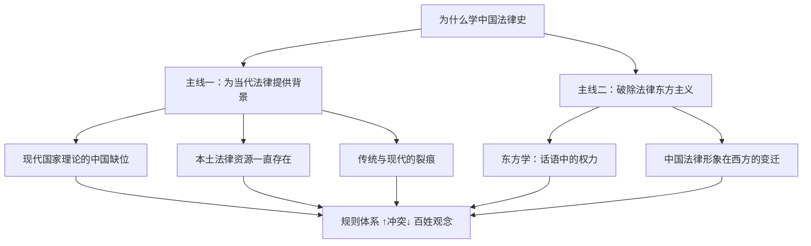
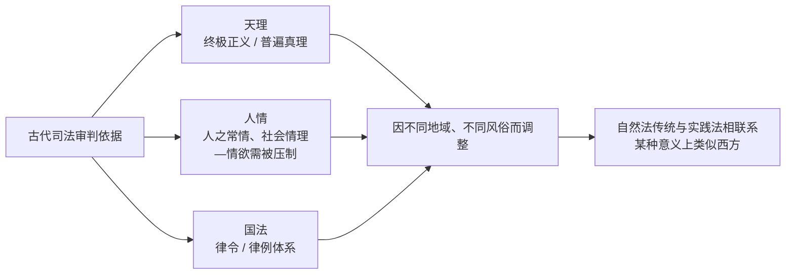

# 中国法律史 · 第1讲：为什么要学习中国法律史

> [!info] 本讲脉络
> 本讲不直接进入具体朝代的法条，而是回答一个前提性问题：**在现代中国法的体系几乎全盘移植自欧陆的前提下，我们为什么还要读"旧法"？** 老师给出两条主线——
> 1. **为当代法律提供背景**：中国当下的法制，是"两大渊源、三大体系"共同塑造的结果，本土并未"断裂"；
> 2. **破除法律东方主义**：跳出"先进—落后"的二元叙事，理解现代法本身的多元性。
>
> 两条主线最终都收束到一个现实张力上——**纸面上的规则体系（国家立法）与老百姓的实质正义观念之间，仍然存在持续冲突。**

---

## 一、为什么学：两条主线



---

## 二、主线一：为当代法律提供背景

### 2.1 现代国家的本质：一个"想象的共同体"

- 现代国家不是自然生长的，而是被**话语与契约**建构出来的——主权是抽象的，国家是"想象的共同体"。
- 西方的理论基石是**社会契约论**，其神学前身是基督教的"**人—神契约**"，经宗教改革转化为"**人与人契约**"，再落到政治上，成为 [[《独立宣言》]] 一类现代国家的政治基石。
- **理论链条**：
  1. [[霍布斯]]《利维坦》：从"一切人反对一切人"的战争状态出发，推出国家；"利维坦"本身就是"海上巨兽"的隐喻——**现代社会对公民权利最大的侵犯者，恰恰是国家**。
  2. [[洛克]]、[[孟德斯鸠]]：由此提出**限权**，即如何控制国家。
  3. 基督教传统在欧洲提供了"契约"概念本身；**中国没有这一传统**，因此很难用同一套语言描述"国家从何形成"。

> [!example] 案例 ①：1982 年宪法为什么不采用社会契约论？
> 中国《宪法》序言是"自然而然地叙述"国家的形成，而不是从"缔约"开始。这并非立法疏漏，而是因为中国缺乏人—神契约—人与人契约的欧洲传统，**直接照搬社会契约论无法解释中国国家的生成逻辑**。

### 2.2 本土资源从未消失：我们不是只有"舶来法"

> [!example] 案例 ②：2018 年《民法典》立法争论
> 立法者反复追问："我们如何制定出一部**体现本民族精神、具有中国特色**的民法典？"答案不在条文里，而在本土实践中：
>
> | 本土实践 | 对应的现代制度雏形 | 功能 |
> |---|---|---|
> | 四川自贡井盐开采 | 有限责任公司的雏形 | 风险与收益的有限化 |
> | 长江中下游航运 | 船东互保、共担海损 | 分散、规避海上风险 |
> | 山西"票号"业务 | 早期金融机构 / 现代银行业 | 资金周转与异地汇兑 |
>
> **结论**："太阳底下无新鲜事"——中国本土早就发展出了处理商业、金融、风险的制度逻辑。学习法律史，是为了走**本土化路线**，而不是一味趋同于西方。

### 2.3 传统与现代的"裂痕"：从晚清修律到当下

**三次制度断层/爆发**（课堂上并列的时间线）：

1. **晚清修律**：本意是借鉴德国法、同时调查各地民事习惯，**最终却"抄袭"了欧陆成文法**；
2. **国民政府制定法律**：继续沿欧陆法典化路径推进；
3. **2000 年初**：本土化与移植法的张力再次集中爆发。

> [!warning] 核心判断：中国古代法真的"断裂"了吗？
> （据课上投影文献整理）
>
> - 清末从欧陆移植了一套迥异于中国传统的法学知识体系和法律编纂方法，其中影响最大的是 **19 世纪中后期欧陆流行的法律实证主义**。
> - 中国古代的"法"本是一个**多层级结构体系**；清末以"六法"取代《大清律例》，把"法源"收归为实证化的法典。**自晚清以来，中国法律规范的创制主要依靠国家这一中心力量——国家垄断了法的制定权，以至于今天我们对"法"的理解，被压缩为仅仅是"国家立法"。**
> - 但作为时间序列上的相对概念，**中国古代法从未真正中断**。中断的是我们的"思考"：
>   - **政治/国法层面**的断裂是清晰的——标志性事件就是《大清律例》被取代；
>   - **文化/天理人情层面**的断裂缓慢而模糊，甚至因为惯性而延续至今。

> [!example] 案例 ③：上访现象
> - **规范层面**：所有争议本来都应当走**司法渠道**。
> - **中国现实**：大量争议被导入**信访局**——这是一种典型的"中国特色"。
> - **原因**：老百姓"信访不信法"，习惯"反映情况"，背后是延续千年的**青天情结**——
>   - 女子到包公祠前大哭，会引起一大群人跟着"哭"；
>   - 制度基础是古代的**登闻鼓制**：允许百姓向皇帝直诉。
> - **观念冲突**：
>   - 古代：追求**结果的公正**（实质正义）；
>   - 现代法律：强调**程序的色彩**（程序正义）。
> - 这正是"规则体系 ↑冲突↓ 百姓观念"在日常生活中的具体表现。

### 2.4 古代司法审判的依据：天理—人情—国法

> [!quote] 引申问题：什么是法？
> - 教科书答案：**统治阶级意志的体现**。
> - 法律实证主义：**法是国家垄断的**——"恶法亦法"。
> - 但中国古代的司法依据远比"国家立法"丰富：



> [!note] 关键区分
> 我们今天所说的"法"，是被**国家垄断**、被**程序**包裹的规则体系；而中国人内心深处的正义观，仍然带着"天理 + 人情"的底色。**这就是为什么形式上西化了的规则，在老百姓那里并不当然被接受。**

---

## 三、主线二：破除法律东方主义

### 3.1 什么是"东方主义"

- 理论来源：[[萨义德]]（E. Said）《[[东方学]]》。
- 核心方法：**反思欧洲中心主义**，揭示"先进—落后"二元叙事是如何被话语建构出来的。
- 福柯（Foucault）《[[知识考古学]]》提供方法论支撑——**话语/知识本身就蕴含权力**。
- 典型例子：历史课本中"古代辉煌—近代落后"的叙事结构，本身就是东方主义的产物。

### 3.2 "东方"一词的起源与污名化

- **起源**：[[波斯帝国]]与希腊的战争。希腊人把对面的波斯称为"东方"（东夷）。
- **建构方式**：通过"贬低对方、抬高自己"来塑造西方认同；"东方"从一开始就**带有负面含义**。
- 这一范围后来被**扩大至中国**。

### 3.3 中国法律形象在西方的变迁（三阶段）

| 阶段 | 西方视角 | 对中国法律/中国的想象 | 代表人物 / 文献 |
|---|---|---|---|
| ① 文艺复兴 ~ 启蒙早期 | **仰视** | 儒学传统被理想化：光宗耀祖、荫庇子孙，世俗意义上的成功（"内卷"）；"孔教乌托邦"——像《理想国》一样由"哲学家"治国 | 耶稣会士记录；[[新教改革]]背景：从"避世苦修"转向"积极推动社会变革"，修习方式改变 |
| ② 启蒙运动鼎盛 | **平视 → 贬抑** | 用**线性史观**对照中国"循环往复的时间观"，得出"**停滞的中国**"的判断 | [[孟德斯鸠]]《[[论法的精神]]》 |
| ③ 马戛尔尼访华（1792） | **俯视** | 定性为"东方专制帝国" | 小斯当东（学会汉语，任翻译）译《[[大清律例]]》→ 在西方被视作"落后法律" |

> [!warning] 文明阶梯论与国际法的不平等
> 西方把世界排成一个阶梯：
>
> ```
> 文明人 ── 半文明（中国）── 野蛮人
>                │
>                └─→ 鸦片战争、不平等条约：
>                    "中国不适用国际法"
> ```
>
> 也就是说，**东方学不仅是学术想象，它还通过"间接性在场"支撑起文化霸权**——知识与权力（Foucault）始终耦合在一起。

### 3.4 对中国法律形象变迁的小结

> [!summary] 为什么这一段也属于"法律史"？
> 因为我们今天对"中国古代法究竟是什么"的判断，**很大程度上是被这几百年的西方想象塑造出来的**。不清理这层"东方主义"的滤镜，我们连自己的法律传统都看不清楚。

---

## 四、延伸：近代知识体系的专业化，及其对法律人的影响

> [!quote] 课堂引言
> "高考前，你是亚里士多德、达·芬奇、斯科特船长、丘吉尔爵士……高考是古典时代通才的葬礼。
> 高考后，你是银行家、程序员、画家、建筑师、律师——你是一枚专业的螺丝钉。
> 每个人都是一部浓缩的文明史。你回望的高三，是一个落幕的、人类文明的青春。"

### 4.1 近代知识体系是如何形成的

- **出发点**：以人的认识能力为出发点，以科学为标准，以认识世界为目标。
- **自然科学**：日心说 + 牛顿力学奠定近代科学体系；实验科学 + 数理逻辑推动技术与生产力。
- **思维革命**：文艺复兴把人从自然和神学束缚中解放出来，**归纳逻辑**取代了演绎逻辑。
- **社会领域**：社会分工精细化 + 现代教育制度 → 人文社会科学也走向**分科性、专业性**。
- **总体特征**：以社会现代化为导向，为回答人类重大问题而产生的**基础性、整全性**知识体系；同时具有**高度分化**和**专业化**两个标签。

### 4.2 专业化的代价

近代知识体系凝聚了认识的深度、广度和精度，但同时带来三个问题：

1. 分化的知识促进了认识深化，却**忽略了整体性**；
2. 它与资本主义生产方式紧密绑定——**资本的逐利本性在侵蚀知识体系的人文价值**；
3. 对**法律人**尤其有三重后果：

> [!danger] 对法律人的三重影响
> 1. **视野窄化**：专业化把完整的知识图谱切成孤岛，使人深陷于自己的领域，失去文艺复兴巨匠那种融会贯通的整体性视野。
> 2. **精神异化**：个体从充满好奇、探索世界的"文明主体"，被规训为服务于特定功能的"专业工具"。
> 3. **人文知识萎缩**：以效率和专业为导向的学科设置，使无法直接介入公共政策与法律讨论的人文知识普遍衰退；进而导致**公共舆论撕裂，难以形成社会共识**。

---

## 五、本讲关键概念索引

| 概念 | 一句话理解 | 相关人物 / 文献 |
|---|---|---|
| [[想象的共同体]] | 现代国家并非自然实体，而是被话语建构的共同体 | —— |
| [[社会契约论]] | 现代国家政治合法性的欧洲理论基石 | 《独立宣言》 |
| [[利维坦]] | 国家作为"海上巨兽"的隐喻，既是保护者也是最大潜在侵权者 | 霍布斯 |
| [[限权]] | 对国家权力的制度化控制 | 洛克、孟德斯鸠 |
| [[法律实证主义]] | 法 = 国家垄断制定的规则；"恶法亦法" | 19 世纪中后期欧陆 |
| [[六法体系]] | 清末以欧陆法典取代《大清律例》的立法成果 | —— |
| [[天理人情国法]] | 古代司法依据的三层结构 | —— |
| [[登闻鼓制]] | 古代允许百姓向皇帝直诉的制度，"青天情结"的源头 | —— |
| [[法律东方主义]] | 以"先进—落后"二元叙事建构非西方的话语方式 | 萨义德《东方学》 |
| [[文明阶梯论]] | 文明人 / 半文明 / 野蛮人的等级化世界想象 | 马戛尔尼使华后定型 |
| [[孔教乌托邦]] | 启蒙早期欧洲把中国想象成"哲学家治国"的理想化图景 | 与《理想国》对读 |
| [[停滞的帝国]] | 启蒙后期用线性史观评判中国的结论 | 孟德斯鸠《论法的精神》 |
