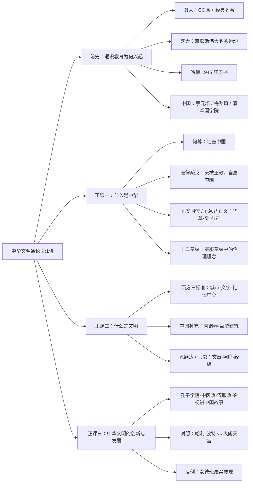
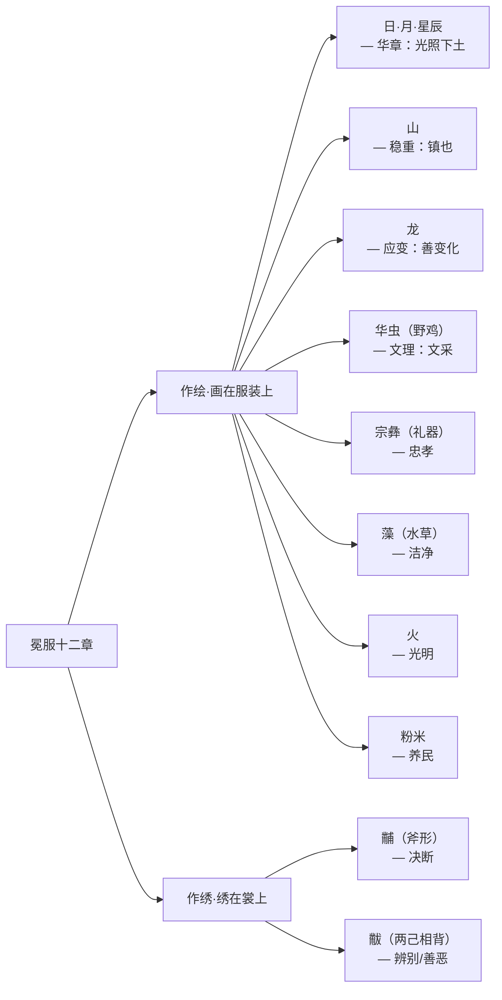

# 中华文明通论 · 第1讲：通识教育与何为中华

> [!info] 本讲脉络
> 这一讲其实是一条"**由教育问题引入文化问题**"的路径：
>
> 1. **前半段（通识教育）**：从 20 世纪上半叶美国高教改革讲起——哥大、芝大、哈佛为何要在"专业教育"之外另立"通识教育"？中国（蔡元培、梅贻琦、清华国学院）又如何接住这个问题？
> 2. **后半段（正课）**：回到"中华文明"本身——"中华"二字怎么来？（[[何尊]]"宅兹中国"、[[唐律疏议]]、十二章纹）；"文明"的判定标准是什么？（城市/文字/礼仪中心 vs 加青铜器/巨型建筑）；西方视野里的中华文明形象（3–13 世纪辉煌—之后停滞—亚当·斯密—李约瑟难题）。
> 3. **收束**：今天我们为什么要"传承优秀传统文化"？又该警惕哪些"伪传统"（如女德班）？

---

## 一、前史：通识教育为什么会兴起

> [!note] 一句话背景
> 通识教育（General Education）不是中国本土概念，而是 20 世纪上半叶美国高教在**两次大战 + 大萧条**的冲击下，对"过度专业化、职业化"的一次反拨。核心焦虑是：**如果大学只把学生训练成"精良的仪器"，自由社会的公民基础就会瓦解。**

### 1.1 美国三校的改革脉络

| 学校 | 关键人物 / 时间 | 标志性做法 |
|---|---|---|
| [[哥伦比亚大学]] | 1919 年，[[约翰·厄斯金]]（John Erskine）开"经典名著"（General Honors）课；[[约翰·科斯]]（John Coss）设计《当代文明》（Contemporary Civilization, CC） | 美国最早面向全体新生的通识必修课 |
| [[芝加哥大学]] | [[赫钦斯]]（Robert M. Hutchins）任校长 1929–1951；1931 年推"New Plan"，1942 年通过赫钦斯学院方案 | "伟大名著"运动（与 Adler 合作），以经典阅读为核心的四年制本科 |
| [[哈佛大学]] | [[科南特]]（James B. Conant）；1943 年任命 12 人教授委员会，**1945 年**出版报告 | 《[[自由社会中的通识教育]]》（"[[哈佛红皮书]]"） |

> [!example] 课堂原话：沃顿商学院"导致"经济大萧条？
> 这是一种**批判性的夸张说法**，不是史学结论——
> 意思是：当顶尖商学院把学生训练成高度专业、只懂金融模型的"精良仪器"，他们对市场风险缺乏人文与历史的想象力，最终加剧了 1929 年式的系统性危机。
> 课堂上还提到：**赫钦斯为推行改革，与芝大资深教授连年斗争，最终才把教改压了下去**——这正是通识教育"反专业主义"代价的一面。

### 1.2 哈佛红皮书（1945）——本讲前半段的核心文本

> [!quote] 关键事实（据课堂投影与公开史料补全）
> - **书名**：《自由社会中的通识教育》（*General Education in a Free Society*）；因哈佛校色为深红色（Crimson），俗称为"**红皮书**"。
> - **发起人**：校长 [[科南特]]（James B. Conant），1943 年组建一个由文理学院与教育学院教授组成的委员会，历时两年调研。
> - **时代背景**：
>   - 大萧条时期学生过度专业化、向职业预科漂移；
>   - 二战结束后大量退伍军人（GI Bill）涌入高校，高校要为他们"疗伤"、重新成为完整的人；
>   - 西方文明本身正面临经济崩溃与世界大战的双重挑战。
> - **核心主张**：把学校教育分为 **通识教育** 与 **专业教育**——
>   > 通识教育指"学生全部教育中，使其首先成为一个**负责任的人和公民**的那一部分"；专业教育则给予某种职业能力。
> - **红皮书要求的四种能力**（课堂笔记原文）：
>   1. **思考力**（effective thinking）
>   2. **沟通力**（communication）
>   3. **判断力**（judgment）
>   4. **辨识普遍性价值的能力**（knowledge of value）
> - **课程做法**：**通识核心课 + 选修课** 的组合，成为后来美国大学 Gen Ed 的模板。

### 1.3 中国如何接住这个问题

> [!note] "通识教育"这个词本身
> "General Education" 在上世纪 40 年代被中国教育界翻译为"**通识教育**"（早期也作"一般教育""普通教育"）。但中国学者的问题意识并不完全来自美国——他们更早就在思考：**大学到底是培养"通人"还是"专家"？**

#### 蔡元培：北大"融通文理"

- 1917 年起在北大推行**选科制（学分制）、废年级制**，明确提出"**沟通文理**"——文学生不能不知理科的基本方法，理科生不能没有文学与哲学的训练。
- 名言："大学为纯粹研究学问之机关，不可视为养成资格之场所，亦不可视为贩卖知识之场所。"

#### 梅贻琦："所谓大学者，非谓有大楼之谓也，有大师之谓也"

> [!quote] 原文出处
> 1931 年 12 月，梅贻琦就任国立清华大学校长的演说（化用《孟子》"所谓故国者，非谓有乔木之谓也，有世臣之谓也"）：
>
> > "**所谓大学者，非谓有大楼之谓也，有大师之谓也。**"
>
> 他另一篇系统阐述通识观的文章是 1941 年发表于《清华学报》的《**大学一解**》，其中提出：
>
> > "**通识为本，专识为末；通材为大，而专家次之。**"

#### 清华国学院（1925–1929）：中国版"通识"的一次实验

- **由来**：清华学校本身是 1911 年用**庚子赔款**退款创办的留美预备学校；1925 年成立**清华国学研究院**，是其转向"综合性大学"的关键一步。
- **四大导师**：[[王国维]]、[[梁启超]]、[[陈寅恪]]、[[赵元任]]；另有讲师[[李济]]（中国考古学之父），主任[[吴宓]]。
  - 除赵元任外，其余三位都**没有博士头衔**——这正是"不唯学历、重真才实学"的招聘标准。
- **学术范式**：中西融会、古今贯通，培养了整整一代国学研究家；1929 年国学院结束，但它确立的"**以大师带动通识**"传统一直影响到今天。
#### 其他几位教育家的补充观点

- [[冯友兰]]《三松堂自序》/《三松堂全集》：在课程设置上主张学生多学社会科学，不能只埋在专业里。
- [[竺可桢]]（浙大老校长）："**谋食 × 谋道**"——大学不能只教学生谋食，还要教学生谋道；其《常识之重要》提出现代知识分子应具备的多种品质（健康判断、社会关怀等）。
#### 今天的中国高校

- 2010 年代后成立"**中国大学通识教育联盟**"；代表性的通识实验学院：
  - 北大 **元培学院**
  - 清华 **新雅书院**
  - 浙大 **竺可桢学院**
  - （以及复旦书院、中山博雅等）

---
## 二、正课一：什么是"中华"

### 2.1 "宅兹中国"——"中国"一词的最早出处

> [!example] 何尊：把"中国"二字铸在青铜上的那只铜尊
> - **器物**：[[何尊]]，西周早期（周成王五年，约公元前 11 世纪）青铜酒器。
> - **出土**：1963 年陕西宝鸡出土；1975 年清理锈迹时发现内底铭文。
> - **铭文**：内底 12 行、共 **122 字**，记载文王受命、武王灭商、成王继承武王遗愿营建东都洛邑（成周）等大事。
> - **关键句**：
>   > "**唯武王既克大邑商，则廷告于天，曰：余其宅兹中国，自之乂民。**"
>   > （武王灭商后告祭于天："我要住在这天下的中央，自此治理民众。"）
> - **意义**：这是目前所见"**中国**"一词最早的**文字记载**；现藏宝鸡青铜器博物院，为中国首批禁止出国（境）展览文物。
### 2.2 "中"与"国"的字源

- **中**：象形，本义是一面**带旒（飘带）的旗帜**——"有旒之旆"；聚族时树旗，引申为**空间上的中央**、文化与政治的**枢机**。
- **国（國）**：从"囗"（围）从"戈"，指有武力护卫的城邑；与"邦""邑"互训，只是范围大小不同——**国 > 邦 > 邑**。
- 所以"中国"最初的意思是：**天下之中的那座城 / 那个政治中心**，不是现代主权国家概念。

### 2.3 "中华"：不看你从哪里来，而看你是否"有威仪"

> [!quote] 课堂笔记核心判断（红字标注）
> "**不追求原来在哪里，而是是否有该威仪**"——
> 这是中华（华夏）最关键的文化主义定义：**是否接受王教、是否行礼义、是否着华服**，决定了你是不是"中华"，而不是血统或出生地。

| 出处                 | 原文大意                            | 说明                       |
| ------------------ | ------------------------------- | ------------------------ |
| [[唐律疏议]]           | "**中华者，中国也。亲被王教，自属中国**……"       | 唐律把"中华"定义为文化归属，而非种族      |
| [[孔安国传]]（伪古文《尚书》传） | "**冕服华章曰华，大国曰夏**"               | "华"来自礼服上的华美章纹，"夏"来自礼仪之盛大 |
| [[孔颖达]]《五经正义》      | 辨析"**被发左衽**"（夷狄）↔"**束发右衽**"（诸夏） | 用服饰与发式区分夷夏               |
| [[左传]]             | "**礼仪之大故称夏，服章之美谓之华**"           | 华夏 = 礼仪之大 + 服章之美         |

### 2.4 从"右衽"到十二章纹：衣冠里的政治哲学

> [!note] 一个看似很小的细节
> 古人穿衣，**交领右衽**（左襟压右襟，领口向右下方）；死者或夷狄则**左衽**。"宽衣解带要用右手"是华夏生活方式的身体表达——连系带方向都成了文明边界。

#### 天子冕服上的"十二章纹"（课堂笔记里列出的几类）

> [!tip] 课堂上反复强调的一句话
> "**每个章级背后都代表一种治理理念。**"
> 礼服不是审美装饰，而是把一整套政治哲学（光明、稳重、应变、文采、忠孝、洁净、养民、决断……）**穿在身上**。这也是"冕服华章曰华"的真正含义。

---

## 三、正课二：什么是"文明"

### 3.1 判定标准的分歧

> [!warning] 一个容易被忽略的方法论问题
> "文明"的判定标准不是天然客观的——它本身就是**西方近代考古学**给出的，然后被中国考古实践补充。

| 标准      | 来源                                          | 具体指标                                   |
| ------- | ------------------------------------------- | -------------------------------------- |
| 西方经典三标准 | 英国考古学家 [[柴尔德]]（V. Gordon Childe，1950 年代）的概括 | ① **城市** ② **文字** ③ **复杂的礼仪中心**（神庙）    |
| 中国学者补充  | 结合中国考古（二里头、殷墟等）                             | 在三标准之上加：④ **青铜器** ⑤ **巨型建筑**（宫殿/陵墓/城垣） |

> [!note] 为什么需要补充？
> 因为早期中国文明（如良渚、陶寺）在"文字"尚未成熟的阶段，已经出现了大型城址、高等级墓葬、青铜礼器——如果死守西方三标准，就会把中华文明的起点往后推。这是"文明含义的复杂性"。

### 3.2 中国人自己怎么定义"文明"

- [[孔颖达]]注《尚书》："**天下有文章而光明**"——有秩序、有文采，才能叫"明"。
- [[马融]]注："**照临四方谓之明，经纬天地谓之文**"——
  - 文：经纬天地（组织社会、建立制度）
  - 明：照临四方（让文明之光照到普通人身上）
- 课堂上的红字总结："**文明像一束光，使普世人们生活更好。**"——这与西方从"civilization / 城市生活"出发的定义路径不同，中国语境里的"文明"更强调**道德与秩序的普照性**。

### 3.3 西方视野中的中华文明形象变迁

> [!quote] 课堂笔记里的两句话
> - "3–13 世纪辉煌，之后中断。"
> - "[[亚当·斯密]]：中国长期最富，但穷者极穷。"

- **3–13 世纪**（大致从汉到宋）：中国在经济、技术、城市规模上长期领先世界——这是后来"[[李约瑟难题]]"的经验起点。
- **亚当·斯密《国富论》（1776）**的原话常被引用：
  > "中国一向是世界上最富的国家……许久以来，它似乎就**停滞于静止状态**了。今日关于中国耕作、勤劳以及人口稠密状况的报告，与五百年前视察该国的马可·波罗的记述比较，几乎没有什么区别。"
  他还认为中国底层劳动者的生活水平，远低于当时欧洲普通劳动者。
- **李约瑟难题**（Joseph Needham）："为什么在前现代社会（约 16 世纪以前）中国科技遥遥领先，却没有产生近代科学与工业革命？"——这一问题本身就是"3–13 世纪辉煌—之后落后"叙事的学术化版本。

["http://www.ihss-en.pku.edu.cn/yjlw1a/articles/1373713249639469056.html","https://news.hunnu.edu.cn/info/1025/54340.htm"]

> [!warning] 警惕
> 这一叙事本身也带有[[法律东方主义]]（参看上一讲笔记）的影子：它既可能是事实判断，也可能是"先进—落后"二元框架下的建构。课堂提出"**关于中华文明的争论：文明的标准？中华文明的起源？**"正是要把这套问题重新打开。

---

## 四、正课三：中华文明的创新与发展

### 4.1 当下"传统文化热"的几种表现（课堂投影列项）

- **机构层面**：儒学院、国学院、孔子学院……
- **生活层面**：中医养生热、汉服热、私塾/书院式教育回潮
- **媒体层面**：影视、游戏、短视频"讲述中国故事"
- **政策表述**：传承优秀传统文化；增强中华文明传播力影响力

### 4.2 一个对照：文化软实力到底怎么"传出去"

> [!example] 课堂上的对比
> - [[哈利·波特]]系列电影：它承载的是**英国文化**（寄宿学校、巫术、英伦景观、英语文学传统），却被全球观众接受为"自己的故事"。
> - 反观《[[大闹天宫]]》（上海美术电影制片厂，1961/1964）：艺术水准极高，但在国际社会长期**不被理解**——东方神话的编码体系没有被西方观众接住。
>
> 这一节的问题意识是：**"讲中国故事"不是把材料搬出去就行，还要让异文化观众能"读"得懂。**

### 4.3 "优秀传统文化" vs "伪传统"

> [!danger] 反例：女德班屡禁屡现
> - 国家相关部门多次叫停"女德班"（宣扬"打不还手、骂不还口""女子无才便是德"等），但它在各地反复以"国学夏令营""家庭教育"的名义复活。
> - 这正是为什么政策表述要特意加"**优秀**"二字——**传统文化本身是中性的，里面既有可普世化的部分（礼仪、服饰、生态智慧），也有必须被现代性过滤掉的部分（性别压迫、人身依附）。**
> - "传承"不是复古，而是**甄别**。

---

## 五、本讲关键概念索引

| 概念 | 一句话理解 | 相关人物 / 文献 |
|---|---|---|
| [[通识教育]] | 与专业教育相对，培养"负责任的人和公民"的那部分教育 | 哈佛红皮书（1945） |
| [[哈佛红皮书]] | 《自由社会中的通识教育》，1945，因哈佛校色得名 | 科南特 |
| [[赫钦斯]] | 芝大校长，伟大名著运动推动者 | *The Higher Learning in America* (1936) |
| [[当代文明课]] | 哥大 1919 年起面向全体新生的必修课 | John Erskine / John Coss |
| [[大学一解]] | 梅贻琦 1941 年文章，"通识为本，专识为末" | 梅贻琦 |
| [[清华国学院]] | 1925–1929，四大导师 + 李济 + 吴宓 | 王国维 / 梁启超 / 陈寅恪 / 赵元任 |
| [[庚子赔款]] | 清华学校的启动资金来源（1911） | —— |
| [[何尊]] | 西周成王时铜器，"宅兹中国"最早出处 | 1963 宝鸡出土 |
| [[唐律疏议]] | "中华者，中国也。亲被王教，自属中国" | 唐·长孙无忌等 |
| [[孔安国传]] | "冕服华章曰华，大国曰夏" | 伪古文《尚书》传 |
| [[孔颖达正义]] | "天下有文章而光明"；辨夷夏 | 唐·《五经正义》 |
| [[交领右衽]] | 华夏服饰符号，左衽为死者/夷狄 | —— |
| [[十二章纹]] | 日、月、星辰、山、龙、华虫、宗彝、藻、火、粉米、黼、黻 | 天子冕服 |
| [[文明三标准]] | 城市、文字、复杂礼仪中心 | Childe |
| [[李约瑟难题]] | 为什么前现代中国领先，却未产生近代科学 | Joseph Needham |
| [[国富论]] | 亚当·斯密论中国"停滞于静止状态" | Adam Smith, 1776 |

---